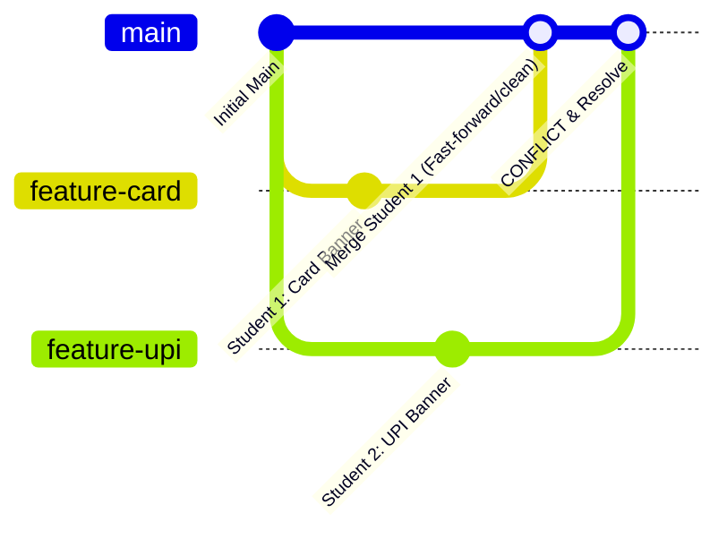

# Day 5: Payment Hierarchy, Interfaces & Git Collaboration

## 📌 Summary
A clean Object-Oriented Payment System built in Java and Apache Maven. It demonstrates the **Payment Hierarchy** using an abstract base class (`Payment`), multiple payment modes (`CardPayment`, `UpiPayment`, `CashPayment`), an independent capability interface (`Refundable`), and **overloaded `pay()` methods**.

It also includes a step-by-step guide on **Git Team Collaboration**: working on separate feature branches, simulating a **merge conflict**, resolving conflict markers, and **rebasing** a branch onto `main`.

---

## 📁 Project Structure

```text
DailyTask/
└── Day05/
    ├── pom.xml                                     # Maven configuration
    ├── README.md                                   # Revision notes & Git collaboration guide
    └── src/
        └── main/
            └── java/
                └── com/
                    └── hcl/
                        └── payment/
                            ├── Refundable.java     # Interface for refundable payment modes
                            ├── Payment.java        # Abstract class with overloaded pay()
                            ├── CardPayment.java    # Subclass implementing Refundable
                            ├── UpiPayment.java     # Subclass implementing Refundable
                            ├── CashPayment.java    # Subclass (non-refundable over-the-counter)
                            └── PaymentApp.java     # Main demonstration runner
```

---

## 🧠 Core OOP Concepts for Revision

### 1. Abstract Class vs. Interface

| Feature | `abstract class Payment` | `interface Refundable` |
|---|---|---|
| **Purpose** | Defines core identity and shared state (`"is-a"` relationship). | Defines an optional capability/contract (`"can-do"` relationship). |
| **State** | Holds instance variables (`transactionId`, `amount`, `status`). | Cannot hold instance variables (only `public static final` constants). |
| **Constructors** | Has constructor to initialize common fields. | Cannot have constructors. |
| **Multiple Inheritance**| A class can extend only **one** class (`extends Payment`). | A class can implement **multiple** interfaces (`implements Refundable, AuditLog`). |
| **Why both?** | All payments are payments, but **not all payments are refundable** (e.g. Cash is non-refundable). |

---

### 2. Method Overloading (`pay()`)
Overloading occurs within the same class (`Payment`) where methods share the same name but have different parameter lists:
- `pay(double amount)`: Standard payment in default currency.
- `pay(double amount, String currency)`: Multi-currency payment.
- `pay(double amount, double discountPercent)`: Promotional payment applying a discount.

---

### 3. Dynamic Polymorphism & Pattern Matching `instanceof`
Treating diverse objects uniformly via the base type, and dynamically checking capabilities:

```java
List<Payment> transactions = List.of(card, upi, cash);

for (Payment p : transactions) {
    p.processPayment(); // Polymorphic dispatch to Card/UPI/Cash

    // Safe capability check:
    if (p instanceof Refundable refundable) {
        refundable.processRefund(p.getAmount());
    } else {
        System.out.println("Non-refundable payment mode.");
    }
}
```

---

## 🛠️ How to Build and Run

### Option 1: Apache Maven (Recommended)
From `DailyTask/Day05`:
```powershell
mvn clean compile exec:java
```

### Option 2: Standard `javac` & `java`
From `DailyTask/Day05`:
```powershell
# Compile all source files
javac -d target/classes src/main/java/com/hcl/payment/*.java

# Run PaymentApp
java -cp target/classes com.hcl.payment.PaymentApp
```

---

## 👥 Git Collaboration: Merge Conflicts & Rebase (Pair Activity)

### 🎯 Objective
Two students work on different branches modifying the same file (`PaymentApp.java`), create a merge conflict, resolve it on `main`, and rebase a secondary branch.



---

### 📝 Step-by-Step Exercise Walkthrough

#### Step 1: Student 1 creates `feature-card`
```powershell
git checkout -b feature-card
```
In `PaymentApp.java`, modify line 22 to:
```java
System.out.println("       DAY 5: PAYMENT SYSTEM [CARD ENHANCED - STUDENT 1]   ");
```
Commit changes:
```powershell
git add src/main/java/com/hcl/payment/PaymentApp.java
git commit -m "feat: student 1 updated app banner for card"
```

---

#### Step 2: Student 2 creates `feature-upi` from `main`
Switch back to `main` first:
```powershell
git checkout main
git checkout -b feature-upi
```
In `PaymentApp.java`, modify the exact same line (line 22) to:
```java
System.out.println("       DAY 5: PAYMENT SYSTEM [UPI ENHANCED - STUDENT 2]    ");
```
Commit changes:
```powershell
git add src/main/java/com/hcl/payment/PaymentApp.java
git commit -m "feat: student 2 updated app banner for upi"
```

---

#### Step 3: Merge Student 1's Branch into `main`
```powershell
git checkout main
git merge feature-card
```
*(This merge succeeds smoothly because no other commits were on main).*

---

#### Step 4: Merge Student 2's Branch (Triggers Merge Conflict!)
```powershell
git merge feature-upi
```
Git will output:
```text
Auto-merging src/main/java/com/hcl/payment/PaymentApp.java
CONFLICT (content): Merge conflict in src/main/java/com/hcl/payment/PaymentApp.java
Automatic merge failed; fix conflicts and then commit the result.
```

---

#### Step 5: Resolve the Conflict Markers
Open `PaymentApp.java`. Git places conflict markers:

```java
<<<<<<< HEAD
System.out.println("       DAY 5: PAYMENT SYSTEM [CARD ENHANCED - STUDENT 1]   ");
=======
System.out.println("       DAY 5: PAYMENT SYSTEM [UPI ENHANCED - STUDENT 2]    ");
>>>>>>> feature-upi
```

**Resolution**: Edit the file, remove all markers (`<<<<<<<`, `=======`, `>>>>>>>`), and combine or choose the final code:
```java
System.out.println("       DAY 5: PAYMENT SYSTEM [INTEGRATED CARD & UPI]       ");
```

Complete the merge:
```powershell
git add src/main/java/com/hcl/payment/PaymentApp.java
git commit -m "fix: resolve merge conflict between feature-card and feature-upi"
```

---

#### Step 6: Rebase a Second Branch onto `main`
Suppose Student 2 has a separate branch `feature-discount`:
```powershell
# Create another feature branch from main
git checkout -b feature-discount

# Make a change in PaymentApp.java and commit
git commit -am "feat: add promotional discount test"

# Meanwhile, main has moved forward. Now rebase feature-discount onto main:
git checkout feature-discount
git rebase main

# If any conflict occurs during rebase:
# 1. Edit the file to resolve conflict
# 2. git add <resolved-file>
# 3. git rebase --continue

# Finally, fast-forward merge onto main:
git checkout main
git merge feature-discount
```

---

## 🚀 Push Day 5 to GitHub

From repository root (`d:\HCLTech`):

```powershell
cd d:\HCLTech

# Stage Day 5 files
git add DailyTask/Day05

# Commit Day 5 completion
git commit -m "Day 5 - Payment hierarchy, Refundable interface, overloaded pay(), and Git merge/rebase workflow"

# Push to your GitHub repository
git push origin main
```
